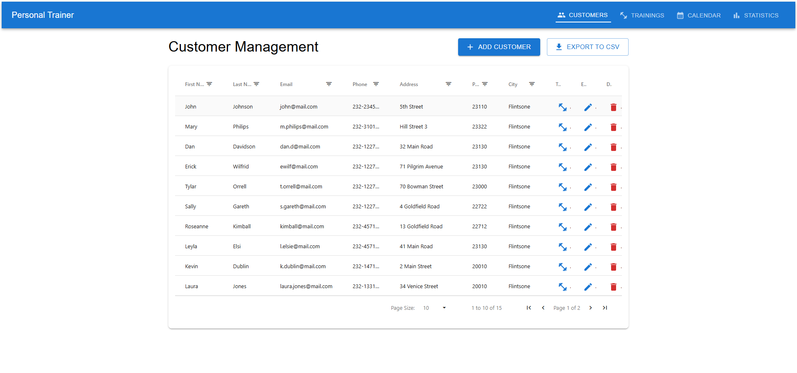
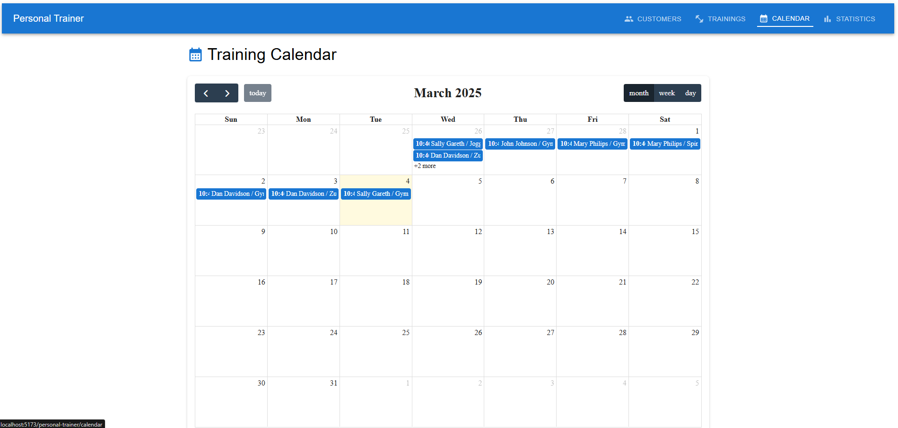
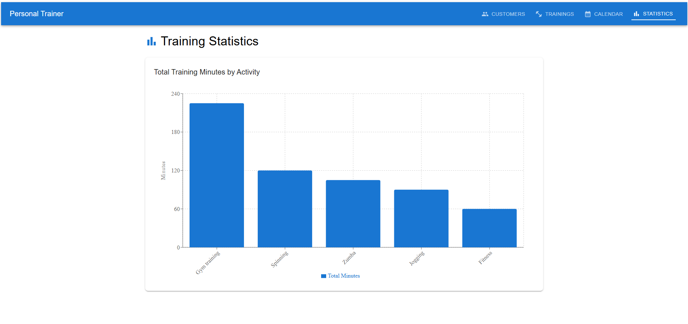
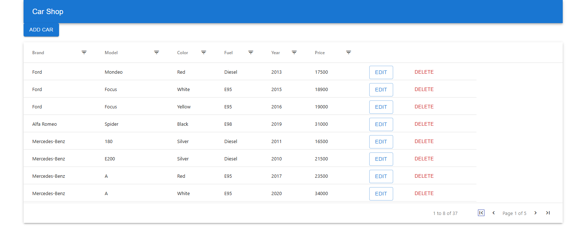

# Personal Trainer App

A responsive React application for personal trainers to manage customers and training sessions with an intuitive user interface.

## Features

- **Customer Management** - Add, edit, delete and export customer information
- **Training List** - View and manage all training sessions with customer details
- **Calendar View** - Interactive calendar showing all scheduled training sessions
- **Statistics Dashboard** - Visualize training data with charts and graphs
- **Responsive Design** - Works seamlessly on both desktop and mobile devices

## Screenshots

Here are some screenshots of the project in action:

<div style="display: flex; justify-content: space-between;">
  
  
</div>

<div style="display: flex; justify-content: space-between;">
  
  
</div>

## Technologies

- **React 18** - Modern UI development with functional components and hooks
- **Vite** - Fast build tooling for modern web development
- **Material UI** - Comprehensive UI component library for a consistent look and feel
- **AG Grid** - Advanced data tables for displaying and manipulating information
- **Recharts** - Simple charting library for statistical visualizations
- **React Router** - Navigation and routing for single page applications
- **FullCalendar** - Feature-rich calendar component
- **Dayjs** - Lightweight date manipulation library

## API

The application uses the provided REST API endpoints:

```
https://customer-rest-service-frontend-personaltrainer.2.rahtiapp.fi/api/
```

Available endpoints:

- `/customers` - Customer management
- `/trainings` - Training session management

## Screenshots

(Add screenshots here to showcase your application)

## Setup and Installation

1. Clone the repository

   ```
   git clone <repository-url>
   cd personal-trainer
   ```

2. Install dependencies

   ```
   npm install
   ```

3. Start development server

   ```
   npm run dev
   ```

4. Build for production

   ```
   npm run build
   ```

5. Preview production build
   ```
   npm run preview
   ```

## Project Structure

```
personal-trainer/
├── public/         # Static assets
├── src/
│   ├── components/ # UI components
│   ├── App.jsx     # Main application component
│   └── main.jsx    # Application entry point
├── index.html      # HTML template
└── vite.config.js  # Vite configuration
```

## License

[MIT](LICENSE)
